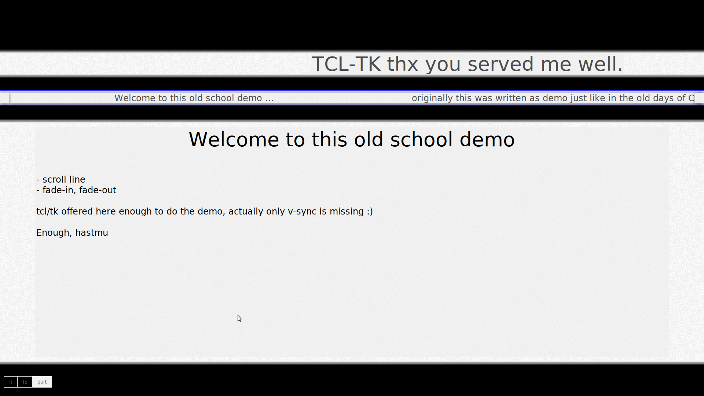

# tcltk-demo
a tcltk demo i did late in the 90's - so sharing this is my thx to all tcltk developers.
Thx you spend all the effort and time.

# Background Story
I did in the end of the 90's some LAN-Parties - yes - exactly what you think - carry a 
super heavy (not large) monitor including PC to a room with a lot of people and network.
Setting up some servers for the games and have some hours of fun.

So for what was this? We needed some welcome stuff for the people and therefore this was
running with onboarding infos and network configs via a beamer (sometimes 640x480, sometimes
800x600, sometimes 1024x768) - fun fact of this i was programming this screen size agnositc
and that was obviously error free therefore it still works with my 4k panel ;).

# How does it look like?

# outlook

If i get borded, i may add:
* OP-Codes for the scrollline - as effect trigger
* more classic demo elements

# know Bugs

* unbelievable loading time (i never debugged that so far, but it was faster on a P166 than today)
* scrollline uses wrong size for "space" so this is a bit jumpy

# Files will follow next weeks...
